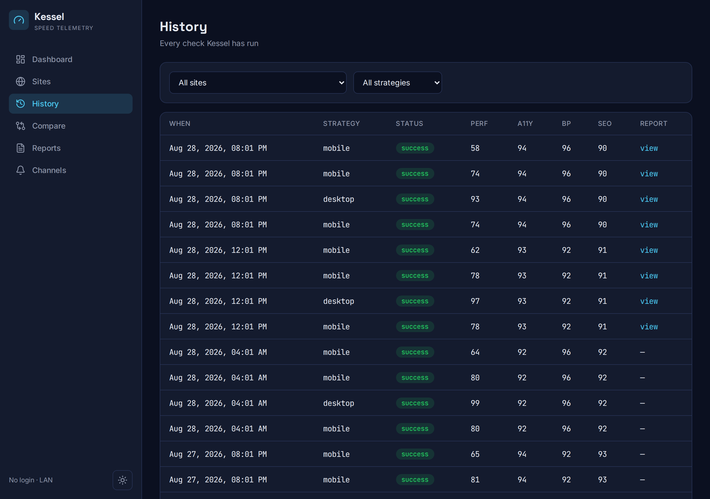
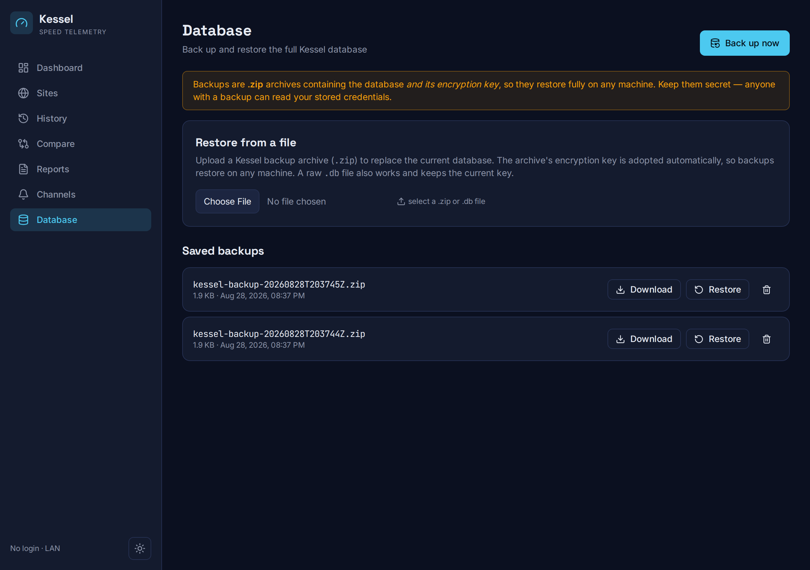
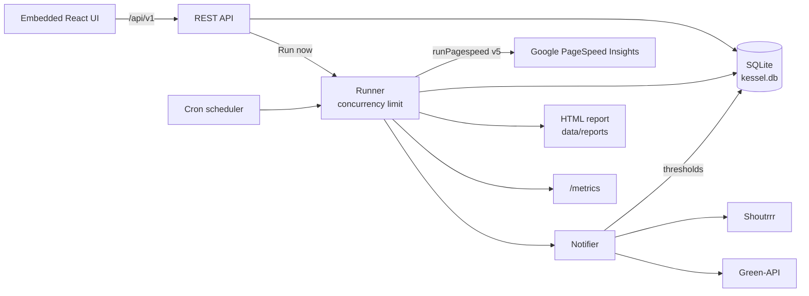

# Kessel

> Website performance monitoring powered by the Google PageSpeed Insights API.
> Named after the Kessel Run, the galaxy's most famous speed benchmark.

Kessel runs PageSpeed Insights (PSI) checks against a list of URLs on a schedule. It stores
the full results, renders each successful check as a standalone HTML report, tracks scores
over time, and sends notifications when scores cross the thresholds you define. It ships as a
**single static binary** with an embedded React UI. Drop it on your LAN and go.

[](https://github.com/t0mer/kessel/actions/workflows/build.yml)
[](https://github.com/t0mer/kessel/releases)
[](LICENSE)
[](https://hub.docker.com/r/techblog/kessel)

---

## Table of contents

- [Features](#features)
- [Screenshots](#screenshots)
- [How it works](#how-it-works)
- [Requirements](#requirements)
- [Installation](#installation)
- [Configuration](#configuration)
- [Usage](#usage)
- [REST API](#rest-api)
- [Prometheus metrics](#prometheus-metrics)
- [Notifications](#notifications)
- [Backup & restore](#backup--restore)
- [Security](#security)
- [Troubleshooting](#troubleshooting)
- [Development](#development)
- [Contributing](#contributing)
- [License](#license)

## Features

- **Site management**: add sites (name, URL, `mobile` / `desktop` / `both`), then enable, disable, edit or delete them.
- **Multiple schedules per site**: standard 5-field cron, descriptors such as `@daily`, and `@every 6h`. Each schedule can be toggled on its own, and all of them are stored in the database, so they survive restarts.
- **Manual "Run now"** from the UI or the API.
- **Full PSI capture**: all four Lighthouse categories (performance, accessibility, best practices, SEO) and the lab metrics LCP, CLS, TBT, FCP, Speed Index and TTI. The **raw PSI JSON is stored gzip-compressed** with every run, so CrUX field data and everything else in the response is kept too.
- **Standalone HTML reports**: self-contained (inline CSS), saved for each successful check with scores, lab metrics and every improvement opportunity with estimated savings (sorted by savings), and served read-only.
- **History & comparison**: a filterable history of every check, per-site trend charts, and a side-by-side diff of two runs with score and metric deltas.
- **Thresholds & alerts**: **per-site**, per-category rules in **absolute** mode (score below X) or **delta** mode (score dropped by more than Y since the previous successful run).
- **Notification channels**: Shoutrrr (Slack, Discord, Telegram, email, ntfy and more) and Green-API (WhatsApp cloud). Each channel has success/failure toggles and a real "send test". Credentials are **encrypted at rest (AES-256-GCM)**. You define channels once and **select them per site**, so each site alerts only its chosen channels.
- **Backup & restore**: one-click backup writes a timestamped `.zip` archive (a consistent `VACUUM INTO` snapshot **plus the encryption key**) to the data folder **and** downloads it. You can restore from a saved archive or an upload. The restore is applied live with no restart, and the archived key is adopted automatically, so backups restore on **any** machine. (A raw `.db` file also restores and keeps the current key.) The archive contains the key, so keep backup files secret.
- **Prometheus metrics** at `/metrics`, structured `log/slog` logging (JSON or text), and a concurrency limit on PSI checks.
- **No login, ever**: Kessel is built for a trusted LAN. It never assumes it's internet-facing and never requires auth.

> WhatsApp multi-device (whatsmeow / QR pairing) is planned. The channel type is reserved, but it is not enabled yet.

## Screenshots

A mobile-first, dark/light instrument console.

### Dashboard
Latest performance gauge and trend sparkline per site.


### Site detail
Per-site history chart, run table, schedules, **per-site threshold rules**, and
**per-site notification channel selection**.


### History
Every check Kessel has run, filterable by site and strategy, with links to the reports.



### Compare
Two-run diff with highlighted score and metric deltas.


### Channels
Reusable notification channels (Shoutrrr, Green-API) with a real "send test".


### Database
One-click backup to a `.zip` archive (database + encryption key), saved to the data folder and downloaded. Restore from a saved archive or an upload.



### Light mode & mobile

| Light theme | Mobile |
|---|---|
|  |  |

## How it works



1. The **scheduler** loads every enabled schedule from the database and registers it as a cron job. It reloads after any schedule create/update/delete or a restore.
2. When a schedule fires (or you click **Run now**), the **runner** checks the site once per strategy (`both` = mobile, then desktop). A check that is already in flight for the same site and strategy is skipped. At most `--psi-concurrency` checks run at once.
3. The **PSI client** calls the PageSpeed Insights v5 API for all four categories. It retries up to 3 times with exponential backoff on HTTP 429, 5xx and network errors.
4. The run is saved to SQLite (scores, lab metrics, gzip'd raw JSON). A successful run is also rendered to `<data-dir>/reports/<site-slug>/<strategy>/<timestamp>.html`.
5. The **notifier** evaluates the site's threshold rules and sends a message to the enabled channels linked to the site (see [Notifications](#notifications)).

Scheduled runs skip disabled sites. **Run now** runs the site even when it is disabled.

## Requirements

- **Docker**, or a prebuilt binary for Linux, macOS or Windows (see [Installation](#installation)).
- Outbound HTTPS access to `www.googleapis.com` (and to your notification providers).
- A **Google PageSpeed Insights API key** (strongly recommended). Kessel runs without one, but keyless requests are heavily rate limited by Google and log a warning at startup. You can create a key in the Google Cloud console for the *PageSpeed Insights API*.
- The sites you test must be reachable **from Google's servers**. PSI can't test URLs that only exist on your LAN.

## Installation

### Docker Compose (recommended)

The repository ships a [`docker-compose.yml`](docker-compose.yml):

```yaml
services:
  kessel:
    image: techblog/kessel:latest
    container_name: kessel
    ports:
      - "8080:8080"
    volumes:
      - kessel-data:/data
    environment:
      TZ: UTC
      KESSEL_LOG_LEVEL: info
      KESSEL_LOG_FORMAT: json
      # KESSEL_PSI_API_KEY: your-pagespeed-insights-api-key
      # KESSEL_ENCRYPTION_KEY: hex-32-byte-key (else generated to /data on first run)
    restart: unless-stopped

volumes:
  kessel-data:
```

```bash
docker compose up -d
open http://localhost:8080
```

The named `kessel-data` volume holds the SQLite database, the AES encryption key
(`kessel.key`, generated on first run), rendered reports, and saved backups. Persist it.

To keep settings in a file, copy [`.env.example`](.env.example) to `.env` and add
`env_file: .env` to the service. (Compose only reads `.env` for `${...}` substitution in
the compose file; it doesn't pass it into the container on its own.)

### Docker

```bash
docker run -d --name kessel \
  -p 8080:8080 \
  -v kessel-data:/data \
  -e KESSEL_PSI_API_KEY=your-api-key \
  --restart unless-stopped \
  techblog/kessel:latest
```

Images are published to Docker Hub as `techblog/kessel:latest` and `techblog/kessel:<version>`
(date-based `YYYY.M.PATCH`) for `linux/amd64`, `linux/arm64` and `linux/arm/v7`. The image
is built `FROM scratch` and starts `kessel serve --data-dir /data`. Because flags win over
environment variables, `KESSEL_DATA_DIR` has no effect in the container; mount your volume
at `/data` instead.

A workflow for publishing to GHCR (`ghcr.io/t0mer/kessel`) also exists, but it is run
manually only and has never been run, so no GHCR image is published.

### Prebuilt binaries

Every [GitHub release](https://github.com/t0mer/kessel/releases) has archives (built with
GoReleaser) for:

| OS | Architectures |
|---|---|
| Linux | `amd64`, `arm64`, `armv6`, `armv7`, `386` |
| macOS | `amd64`, `arm64` |
| Windows | `amd64`, `arm64` |

```bash
tar xzf kessel_<version>_linux_amd64.tar.gz
./kessel serve --data-dir ./data --psi-api-key your-api-key
```

Archives are named `kessel_<version>_<os>_<arch>.tar.gz` (`.zip` on Windows). Verify them
against `checksums.txt`. The UI is embedded, so the binary is all you need.

### Build from source

Requirements: Go 1.25+ (see `go.mod`) and Node 20.

```bash
# Build the UI first; it is embedded into the binary from web/dist
cd web && npm ci && npm run build && cd ..
go build -o kessel ./cmd/kessel
./kessel serve --data-dir ./data
```

`scripts/build.sh` cross-compiles all targets into `dist/` (set `VERSION` to stamp the
version).

## Configuration

Kessel is configured with flags on the `serve` command, environment variables (prefix
`KESSEL_`), or a YAML file. Precedence is **flags > environment > YAML config file >
defaults**.

| Flag | Env | YAML key | Default | Description |
|---|---|---|---|---|
| `--port` | `KESSEL_PORT` | `port` | `8080` | HTTP listen port (1–65535) |
| `--data-dir` | `KESSEL_DATA_DIR` | `data-dir` | `/data` | SQLite DB, key file, reports, and backups. In Docker the image passes `--data-dir /data`, so `KESSEL_DATA_DIR` is ignored there |
| `--psi-api-key` | `KESSEL_PSI_API_KEY` | `psi-api-key` | _(empty)_ | PageSpeed Insights API key (keyless if empty) |
| `--psi-concurrency` | `KESSEL_PSI_CONCURRENCY` | `psi-concurrency` | `2` | Max concurrent PSI checks (≥ 1) |
| `--log-level` | `KESSEL_LOG_LEVEL` | `log-level` | `info` | `debug` / `info` / `warning` / `error` |
| `--log-format` | `KESSEL_LOG_FORMAT` | `log-format` | `json` | `json` (prod) / `text` (dev) |
| `--encryption-key` | `KESSEL_ENCRYPTION_KEY` | `encryption-key` | _(generated)_ | Hex-encoded 32-byte (64 hex characters) AES key. If unset, a key is generated to `<data-dir>/kessel.key` |
| `--config` | — | — | _(none)_ | Path to a YAML config file (flag only; there is no env var for it) |
| — | `TZ` | — | — | Time zone for cron schedules and log timestamps on host installs. It has no effect in the Docker image (see [Troubleshooting](#troubleshooting)) |

Example `kessel.yaml`:

```yaml
port: 8080
data-dir: /var/lib/kessel
psi-api-key: your-api-key
psi-concurrency: 2
log-level: info
log-format: text
```

```bash
kessel serve --config kessel.yaml
```

Other commands: `kessel --version` prints the build version, and `kessel --help` /
`kessel serve --help` show usage.

Sites, schedules, thresholds and channels are **not** part of the startup config. You manage
them in the UI (or via the API), and they are stored in the database.

### Data directory layout

```text
<data-dir>/
├── kessel.db          # SQLite database (WAL mode)
├── kessel.key         # AES-256 key (0600), only when no key is supplied via flag/env
├── reports/<site-slug>/<strategy>/<YYYYMMDDTHHMMSSZ>.html
└── backups/kessel-backup-<YYYYMMDDTHHMMSSZ>.zip
```

## Usage

1. **Sites**: add a site with a name, an `http(s)` URL and a strategy (`mobile`, `desktop` or `both`). Kessel derives a unique slug from the name; the slug is used in report paths and metric labels.
2. **Site detail**: open a site to:
   - add **schedules**, e.g. `@every 6h`, `0 */4 * * *` or `@daily`, and toggle them on or off;
   - add **threshold rules** (see below);
   - choose which **notification channels** alert for this site;
   - click **Run now** and browse the run history and trend chart.
3. **Dashboard**: the latest performance score and a trend sparkline per site. Data refreshes every 60 seconds.
4. **History**: every check, filterable by site and strategy, with links to the reports.
5. **Compare**: pick two runs to see score and metric deltas (B − A).
6. **Reports**: browse the saved HTML reports of the last 100 runs.
7. **Channels**: create, edit, test, enable/disable and delete notification channels.
8. **Database**: create, download, delete and restore backups.

### Schedule syntax

Schedules use [robfig/cron](https://pkg.go.dev/github.com/robfig/cron/v3) standard parsing:

| Form | Example | Meaning |
|---|---|---|
| 5-field cron (minute hour day-of-month month day-of-week) | `0 */4 * * *` | Every 4 hours, on the hour |
| Descriptor | `@hourly`, `@daily`, `@weekly`, `@monthly` | Predefined intervals |
| Interval | `@every 6h`, `@every 90m` | Fixed interval from when the schedule is loaded |

Seconds fields aren't supported. Invalid expressions are rejected with HTTP 400.

### Threshold semantics

Rules are per site and apply to both strategies of that site. Scores are 0–100.

| Mode | Breaches when | Example |
|---|---|---|
| `absolute` | current score `<` value | `performance` / `absolute` / `80` fires when performance is 79 or lower |
| `delta` | previous − current `>` value | `seo` / `delta` / `5` fires when SEO drops by more than 5 points |

- Categories: `performance`, `accessibility`, `best_practices`, `seo`.
- A `delta` rule compares against the **previous successful run of the same site and strategy**. It is skipped when there is no previous run.
- Rules are skipped when the category score is missing from the PSI response.

## REST API

The API lives under `/api/v1` and speaks JSON. There is **no authentication**. Errors come
back as `{"error": "..."}`. IDs are integers, and timestamps are RFC 3339 UTC.

| Method | Path | Description |
|---|---|---|
| `GET` | `/api/v1/sites` | List sites |
| `POST` | `/api/v1/sites` | Create a site (201) |
| `GET` | `/api/v1/sites/{id}` | Read a site |
| `PUT` | `/api/v1/sites/{id}` | Update a site |
| `DELETE` | `/api/v1/sites/{id}` | Delete a site and its schedules, runs and rules (204) |
| `POST` | `/api/v1/sites/{id}/run` | Trigger a manual run in the background (202) |
| `GET` | `/api/v1/sites/{id}/schedules` | List a site's schedules |
| `POST` | `/api/v1/sites/{id}/schedules` | Create a schedule (201) |
| `PUT` | `/api/v1/schedules/{id}` | Update a schedule |
| `DELETE` | `/api/v1/schedules/{id}` | Delete a schedule (204) |
| `GET` | `/api/v1/sites/{id}/thresholds` | List a site's threshold rules |
| `POST` | `/api/v1/sites/{id}/thresholds` | Create a threshold rule (201) |
| `PUT` | `/api/v1/thresholds/{id}` | Update a threshold rule |
| `DELETE` | `/api/v1/thresholds/{id}` | Delete a threshold rule (204) |
| `GET` | `/api/v1/sites/{id}/channels` | Read the channel IDs that alert this site |
| `PUT` | `/api/v1/sites/{id}/channels` | Replace the channel IDs that alert this site |
| `GET` | `/api/v1/runs` | List runs, newest first. Query: `site_id`, `strategy`, `limit` (default 50), `offset` |
| `GET` | `/api/v1/runs/{id}` | Run detail |
| `GET` | `/api/v1/runs/{id}/report` | Rendered HTML report (404 if none) |
| `GET` | `/api/v1/compare?a={runID}&b={runID}` | Diff two runs (deltas are `b − a`) |
| `GET` | `/api/v1/channels` | List channels (config is never returned) |
| `POST` | `/api/v1/channels` | Create a channel (201) |
| `PUT` | `/api/v1/channels/{id}` | Update a channel (config is re-encrypted only if supplied) |
| `DELETE` | `/api/v1/channels/{id}` | Delete a channel (204) |
| `POST` | `/api/v1/channels/test` | Send a real test message with an unsaved config |
| `GET` | `/api/v1/backups` | List backup archives, newest first |
| `POST` | `/api/v1/backups` | Create a backup archive (201) |
| `GET` | `/api/v1/backups/{name}` | Download a backup archive |
| `DELETE` | `/api/v1/backups/{name}` | Delete a backup archive (204) |
| `POST` | `/api/v1/backups/{name}/restore` | Restore from a saved archive |
| `POST` | `/api/v1/restore` | Restore from an uploaded `.zip` or raw `.db` (multipart field `file`) |
| `GET` | `/healthz` | Liveness: `{"status":"ok","version":"..."}` |
| `GET` | `/metrics` | Prometheus metrics |

### Request bodies

```jsonc
// POST/PUT /api/v1/sites  (enabled is optional, PUT only)
{ "name": "Example", "url": "https://example.com", "strategy": "both", "enabled": true }

// POST/PUT /api/v1/sites/{id}/schedules, /api/v1/schedules/{id}  (enabled optional, PUT only)
{ "cron_expr": "@every 6h", "enabled": true }

// POST/PUT /api/v1/sites/{id}/thresholds, /api/v1/thresholds/{id}  (enabled optional, PUT only)
{ "category": "performance", "mode": "absolute", "value": 80, "enabled": true }

// PUT /api/v1/sites/{id}/channels
{ "channel_ids": [1, 3] }

// POST /api/v1/channels  (notify_on_success defaults to false, notify_on_failure to true)
{ "type": "shoutrrr", "name": "Team Slack", "notify_on_success": false,
  "notify_on_failure": true, "config": { "url": "slack://token@channel" } }

// POST /api/v1/channels/test
{ "type": "greenapi", "config": { "instance_id": "...", "token": "...", "phone": "972501234567" } }
```

### Examples

```bash
# Create a site and schedule it every 6 hours
curl -s -X POST localhost:8080/api/v1/sites \
  -H 'Content-Type: application/json' \
  -d '{"name":"Example","url":"https://example.com","strategy":"both"}'
curl -s -X POST localhost:8080/api/v1/sites/1/schedules \
  -H 'Content-Type: application/json' -d '{"cron_expr":"@every 6h"}'

# Run it now
curl -s -X POST localhost:8080/api/v1/sites/1/run
# {"site":"example","status":"started"}

# Latest runs for the site
curl -s 'localhost:8080/api/v1/runs?site_id=1&limit=2'
```

A run looks like this:

```json
{
  "id": 42, "site_id": 1, "strategy": "mobile", "status": "success",
  "started_at": "2026-08-28T20:01:00Z", "finished_at": "2026-08-28T20:01:24Z",
  "scores":  { "performance": 74, "accessibility": 94, "best_practices": 96, "seo": 90 },
  "metrics": { "lcp_ms": 3120.5, "cls": 0.02, "tbt_ms": 310, "fcp_ms": 1450, "si_ms": 2890, "tti_ms": 5200 },
  "report_path": "/data/reports/example/mobile/20260828T200100Z.html"
}
```

`status` is `success` or `error`. Failed runs carry an `error` message and no report. Score
and metric values are `null` when PSI didn't return them. `GET /runs` wraps the items as
`{"items": [...], "total": N, "limit": 50, "offset": 0}`.

## Prometheus metrics

`GET /metrics` serves Kessel's own registry (no Go runtime or process collectors):

| Metric | Type | Labels | Description |
|---|---|---|---|
| `kessel_checks_total` | counter | `site`, `strategy`, `status` | PSI checks run (`status` = `success` / `error`) |
| `kessel_check_duration_seconds` | histogram | `site`, `strategy` | PSI check duration (default Prometheus buckets) |
| `kessel_last_score` | gauge | `site`, `strategy`, `category` | Latest category score (0–100) |
| `kessel_notifications_total` | counter | `status` | Notification sends (`sent` / `error`) |

`site` is the site slug. `category` is `performance`, `accessibility`, `best_practices` or
`seo`. Metrics live in memory and start empty after a restart.

```yaml
scrape_configs:
  - job_name: kessel
    static_configs:
      - targets: ["kessel:8080"]
```

## Notifications

After every run, Kessel evaluates the site's enabled threshold rules. The run counts as a
**failure** if the check errored or any rule was breached, and as a **success** otherwise. It
then sends one message to each **enabled** channel **linked to that site** whose
`notify_on_failure` / `notify_on_success` toggle matches the outcome. Sending is best-effort:
errors are logged, counted in `kessel_notifications_total{status="error"}` and recorded in
the database, and they never fail the run.

New channels aren't linked to any site. Link them on each site's detail page (or with
`PUT /api/v1/sites/{id}/channels`).

| Type | `type` value | Config fields |
|---|---|---|
| [Shoutrrr](https://containrrr.dev/shoutrrr/) | `shoutrrr` | `url` (required), e.g. `slack://token@channel`, `discord://token@id`, `telegram://token@telegram?chats=@channel`, `ntfy://...`, `smtp://...` |
| [Green-API](https://green-api.com/) (WhatsApp cloud) | `greenapi` | `instance_id`, `token`, `phone` (all required); `api_url` (optional, default `https://api.green-api.com`) |

Green-API notes:

- `phone` is in international format, digits only (e.g. `972501234567`). Kessel appends `@c.us` unless the value already contains `@`, so you can also pass a group chat ID.
- If your Green-API console shows a cluster-specific URL (e.g. `https://7103.api.greenapi.com`), set it as `api_url`.
- All fields are trimmed of whitespace before sending.

Example messages:

```text
Kessel ⚠️ Example (mobile): 1 threshold breach(es)
• performance 58 below 80
https://example.com
Report: /data/reports/example/mobile/20260828T200100Z.html
```

```text
Kessel ✅ Example (desktop): all thresholds OK
https://example.com
```

## Backup & restore

From the **Database** page (or the API):

- **Backup** takes a consistent snapshot of the live database with SQLite `VACUUM INTO` (no downtime) and writes `<data-dir>/backups/kessel-backup-<UTC timestamp>.zip`. The UI also downloads it.
- **Archive format**: a zip with two entries: `kessel.db` (the SQLite snapshot) and `kessel.key` (the hex encryption key). Rendered HTML reports aren't included.
- **Restore** from a saved archive or an upload (`.zip` or a raw `.db`, up to 2 GiB). Kessel checks the file (`PRAGMA integrity_check` plus the Kessel schema), swaps it in, migrates it to the current schema and reloads the scheduler, with no restart. The previous database is rolled back only if copying or reopening the new file fails. If the migration fails after the swap, or (for a `.zip`) the archived key is invalid or can't be written, the new database stays in place. Keep a fresh backup before restoring.
- A `.zip` restore **adopts the archived key**. When the key is file-backed, it is written to `kessel.key`. A raw `.db` restore keeps the current key, so channels encrypted with a different key can't be decrypted.
- If you supply the key with `--encryption-key` / `KESSEL_ENCRYPTION_KEY`, an adopted key applies only until the next restart. After restoring an archive from another install, update the flag/env to the archived key, or re-enter the channel credentials.

## Security

- **Kessel has no authentication.** Anyone who can reach the port can read the data, change the config, download backups (which contain the encryption key) and restore a database. Run it on a trusted network only. Don't expose it to the internet; if you need remote access, put it behind a VPN or an authenticating reverse proxy.
- Channel configs (tokens, webhook URLs) are encrypted at rest with AES-256-GCM. The key comes from `--encryption-key` / `KESSEL_ENCRYPTION_KEY`, or is generated to `<data-dir>/kessel.key` (mode `0600`) on first run. Losing the key makes the saved channels unreadable.
- The API never returns channel configs after saving.
- On network errors, the error text of a failed check can include the PSI API key. That text is stored with the run, returned by `GET /api/v1/runs`, logged, and sent in failure notifications. Likewise, a failed Green-API send can put the channel token in the logs and the notification error log. Treat logs, run errors and notification targets as sensitive.
- The PSI API key is sent to Google as a query parameter. Restrict the key to the PageSpeed Insights API in the Google Cloud console.
- The report viewer and the backup download serve only files inside their directories (no path traversal).
- **Backup archives contain the encryption key** so they restore anywhere. Treat them as secrets. They are written with mode `0600`, uploads are size-capped, and archive extraction is bounded against zip bombs. Restores are validated first, but they only roll back if the file copy or reopen fails (see [Backup & restore](#backup--restore)).
- Keep `.env` files and the data volume private. `.env` is gitignored, and `.env.example` contains only placeholders.

## Troubleshooting

| Symptom | Cause / fix |
|---|---|
| Startup log: `PSI API key not set; using keyless PageSpeed Insights` | Set `KESSEL_PSI_API_KEY`. Keyless requests hit Google's rate limits quickly. |
| Runs fail with `PSI API returned status 429` | Rate limited. Add an API key, lower `--psi-concurrency`, or space out schedules. |
| Runs fail with `PSI API returned status 400` / `500` | PSI couldn't load the URL. Check that it is publicly reachable and returns a page. |
| Schedules fire at the wrong hour in Docker | The image is built `FROM scratch` with no zoneinfo, and the binary doesn't embed `time/tzdata`, so `TZ` has no effect and schedules run in UTC. A `CRON_TZ=` prefix also fails in the image (it works for host binaries that have zoneinfo). Write schedules in UTC. |
| Errors about a deleted site keep appearing in the logs | Deleting a site removes its schedules but doesn't reload the scheduler, so the old entries keep firing (and logging `loading site` errors) until the next schedule change, restore or restart. Restart Kessel, or create/update/delete any schedule, to clear them. |
| `invalid configuration: ...` at startup | A flag/env value is out of range, e.g. an unknown `log-level` or `psi-concurrency` < 1. |
| `loading encryption key: ...` at startup | `KESSEL_ENCRYPTION_KEY` or `kessel.key` isn't 64 hex characters. |
| Notifications show `decrypt config` errors | The channels were encrypted with a different key (e.g. after restoring a raw `.db`). Restore the matching key or re-enter the channel credentials. |
| A site gets no alerts | Check that the channel is enabled, **linked to the site**, and has the right success/failure toggle. |
| Run now does nothing | A check for the same site and strategy is already in flight; it is skipped. Check the logs. |

## Development

```bash
# Backend (:8080) + Vite dev server (:5173, proxies /api, /healthz, /metrics) with hot reload
./scripts/dev.sh            # data goes to ./data (override with DATA_DIR)

go vet ./...
go test -race ./...
cd web && npm run typecheck && npm run build
```

Project layout:

```text
cmd/kessel/         # CLI entry point (cobra: `serve`)
internal/
  api/              # REST API handlers (/api/v1), backup/restore
  app/              # composition root
  config/           # flags / env / YAML (viper)
  crypto/           # AES-256-GCM cipher + key manager
  logging/          # slog setup
  metrics/          # Prometheus collectors
  notify/           # threshold evaluation + Shoutrrr / Green-API senders
  psi/              # PageSpeed Insights v5 client + result parsing
  report/           # standalone HTML report renderer
  runner/           # check execution, concurrency, in-flight dedupe
  scheduler/        # cron scheduling (robfig/cron)
  server/           # chi router, /healthz, SPA fallback
  store/            # SQLite (modernc.org/sqlite) + migrations
  version/          # build version (-ldflags)
web/                # React + TypeScript + Vite + Tailwind UI (built into web/dist, embedded)
scripts/            # build.sh, dev.sh, next-version.sh
```

### CI / release

| Workflow | Trigger | What it does |
|---|---|---|
| `build.yml` | push to `main`, PRs | `go vet`, `go test -race`, `go build`; frontend typecheck + build |
| `release.yml` | manual | Tags `YYYY.M.PATCH` and runs GoReleaser (binaries + GitHub release) |
| `docker.yml` | after a successful Release, or manual | Multi-arch image to Docker Hub `techblog/kessel` |
| `publish-ghcr.yml` | manual | Multi-arch image to `ghcr.io/t0mer/kessel` |

## Contributing

Issues and pull requests are welcome. Please run `go vet ./...`, `go test ./...` and
`npm run build` in `web/` before opening a PR, and keep one logical change per commit.

## License

[Apache-2.0](LICENSE).
