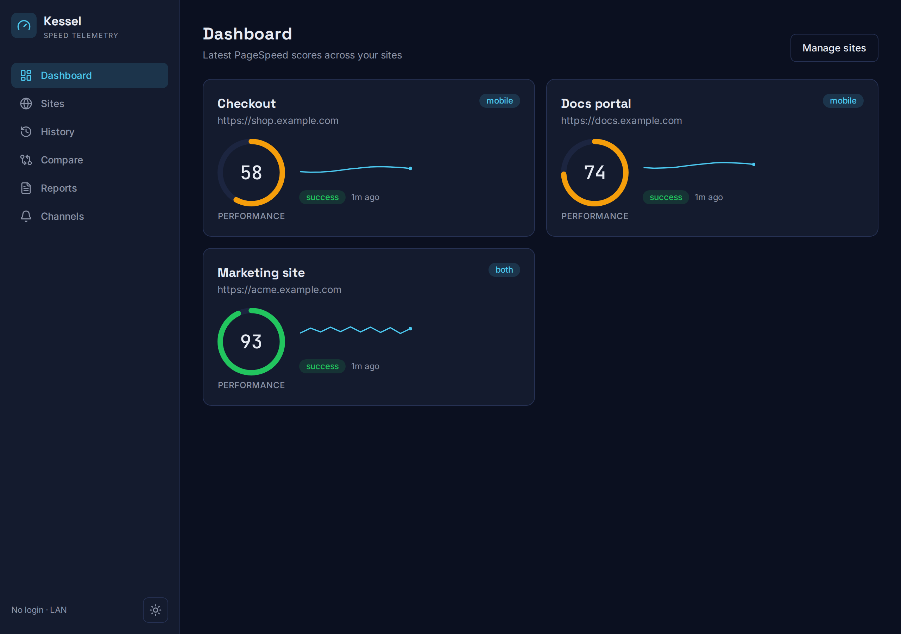
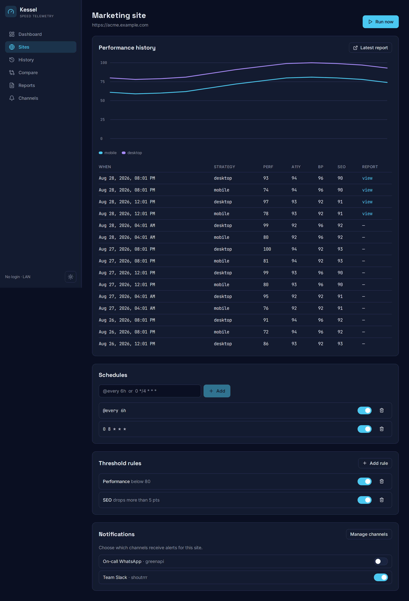
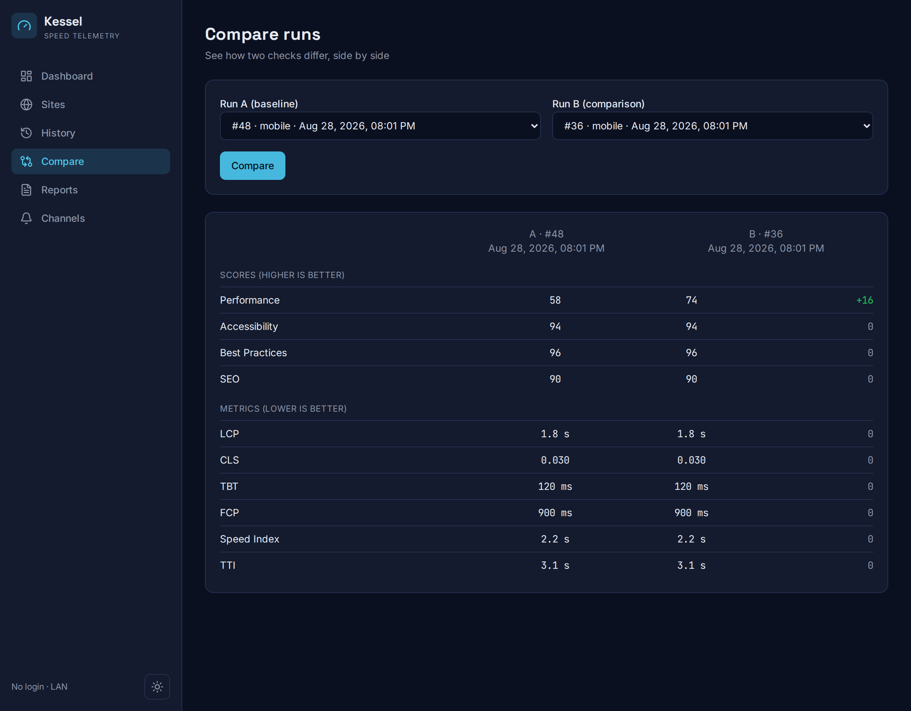
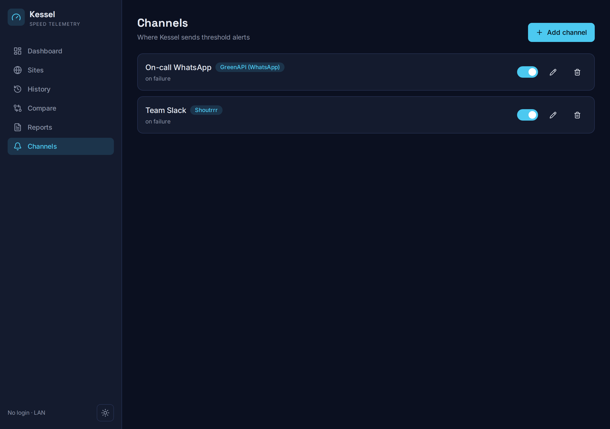
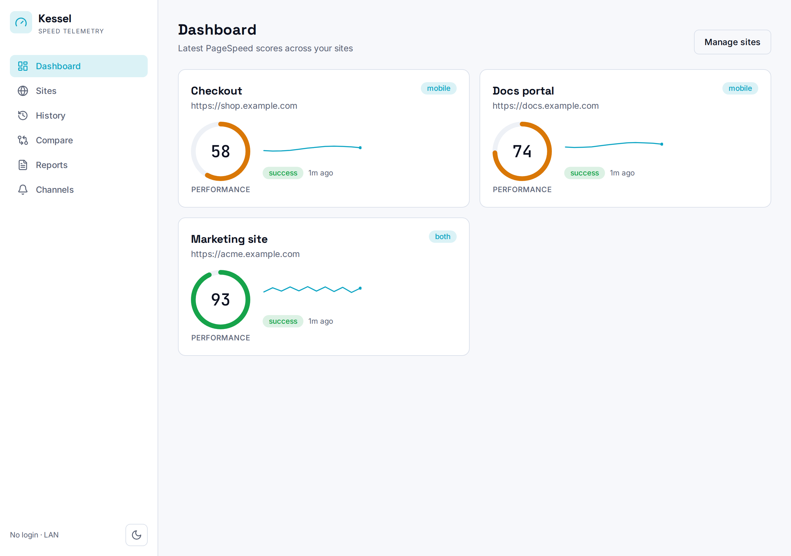
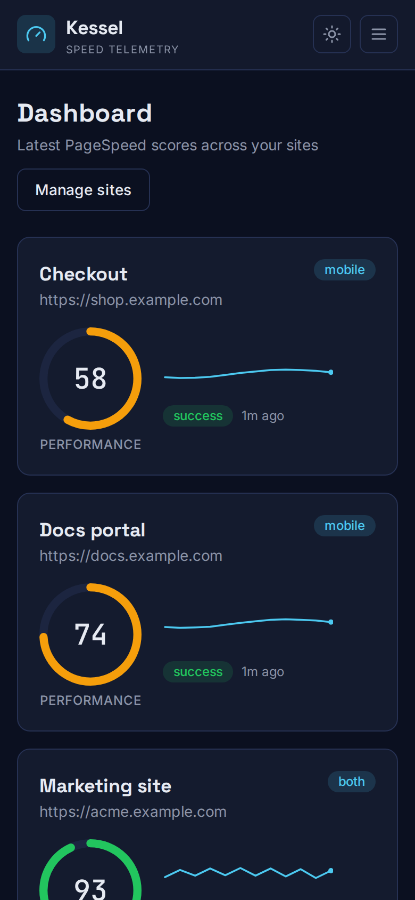

# Kessel

> Website performance monitoring powered by the Google PageSpeed Insights API.
> Named after the Kessel Run — the galaxy's most famous speed benchmark.

Kessel periodically runs PageSpeed Insights checks against a list of URLs, stores
full results, renders each check as a standalone HTML report, tracks scores over
time, and sends notifications when scores cross the thresholds you define. It ships
as a **single static binary** with an embedded React UI — drop it on your LAN and go.


---

## Features

- **Site management** — add sites (name, URL, `mobile` / `desktop` / `both`), enable/disable, delete.
- **Multiple schedules per site** — standard 5-field cron plus `@every 6h`; individually toggleable; survive restarts.
- **Manual "Run now"** from the UI or API.
- **Full PSI capture** — all four Lighthouse categories, Core Web Vitals lab metrics (LCP, CLS, TBT, FCP, Speed Index, TTI), CrUX field data when present, and the **raw JSON stored gzip-compressed**.
- **Standalone HTML reports** — self-contained (inline CSS), saved per check, browsable and served read-only.
- **History & comparison** — per-site trend charts and a side-by-side two-run diff with score/metric deltas.
- **Thresholds & alerts** — **per-site**, per-category rules in **absolute** (below X) or **delta** (dropped > Y) mode.
- **Notification channels** — Shoutrrr (Slack, Discord, Telegram, email, ntfy, …) and GreenAPI (WhatsApp cloud), each with success/failure toggles and a real "send test". Credentials **encrypted at rest (AES-256-GCM)**. Channels are defined once and **selected per site**, so each site alerts only its chosen channels.
- **Prometheus metrics** at `/metrics`, structured `log/slog` logging, safe concurrency with configurable spacing.
- **No login, ever** — built for a trusted LAN; it never assumes it's internet-facing and never requires auth.

> WhatsApp multi-device (whatsmeow / QR pairing) is planned; the channel type is reserved but not yet enabled.

## Screenshots

A mobile-first, dark/light instrument console.

### Dashboard
Latest performance gauge and trend sparkline per site.



### Site detail
Per-site history chart, run table, schedules, **per-site threshold rules**, and
**per-site notification channel selection**.



### Compare
Two-run diff with highlighted score and metric deltas.



### Channels
Reusable notification channels (Shoutrrr, GreenAPI) with a real "send test".



### Light mode & mobile

| Light theme | Mobile |
|---|---|
|  |  |

## Quickstart (Docker Compose)

```yaml
services:
  kessel:
    image: techblog/kessel:latest
    ports: ["8080:8080"]
    volumes:
      - kessel-data:/data
    environment:
      TZ: UTC
      KESSEL_PSI_API_KEY: "" # optional; keyless works with heavy rate limits
    restart: unless-stopped
volumes:
  kessel-data:
```

```bash
docker compose up -d
open http://localhost:8080
```

The named `kessel-data` volume holds the SQLite database, the AES encryption key
(`kessel.key`, generated on first run), and rendered reports — persist it.

## Run from source

```bash
# Backend + frontend with hot reload (backend :8080, Vite :5173)
./scripts/dev.sh

# Or build the single binary with the embedded UI
cd web && npm ci && npm run build && cd ..
go build -o kessel ./cmd/kessel
./kessel serve --data-dir ./data
```

Requirements: Go (see `go.mod`), Node 20.

## Configuration

Precedence is **flags > environment (`KESSEL_`) > YAML config file > defaults**.
Runtime-changeable settings (thresholds, channels) are edited in the UI and stored
in the database.

| Flag | Env | Default | Description |
|---|---|---|---|
| `--port` | `KESSEL_PORT` | `8080` | HTTP listen port |
| `--data-dir` | `KESSEL_DATA_DIR` | `/data` | SQLite DB, key file, and reports |
| `--psi-api-key` | `KESSEL_PSI_API_KEY` | _(empty)_ | PageSpeed Insights API key (keyless if empty) |
| `--psi-concurrency` | `KESSEL_PSI_CONCURRENCY` | `2` | Max concurrent PSI checks |
| `--log-level` | `KESSEL_LOG_LEVEL` | `info` | `debug` / `info` / `warning` / `error` |
| `--log-format` | `KESSEL_LOG_FORMAT` | `json` | `json` (prod) / `text` (dev) |
| `--encryption-key` | `KESSEL_ENCRYPTION_KEY` | _(generated)_ | Hex 32-byte AES key; generated to the data dir if unset |
| `--config` | — | _(none)_ | Path to a YAML config file |

`--version` prints the build version; `--help` shows usage.

## REST API

All endpoints live under `/api/v1` and speak JSON. Selected routes:

| Method | Path | Description |
|---|---|---|
| `GET/POST` | `/sites` | List / create sites |
| `GET/PUT/DELETE` | `/sites/{id}` | Read / update / delete a site |
| `POST` | `/sites/{id}/run` | Trigger a manual run (202) |
| `GET/POST` | `/sites/{id}/schedules` | List / create schedules |
| `PUT/DELETE` | `/schedules/{id}` | Update / delete a schedule |
| `GET/POST` | `/sites/{id}/thresholds` | List / create threshold rules (per site) |
| `PUT/DELETE` | `/thresholds/{id}` | Update / delete a threshold rule |
| `GET/PUT` | `/sites/{id}/channels` | Read / set the channels that alert this site |
| `GET` | `/runs` | List runs (`site_id`, `strategy`, `limit`, `offset`) |
| `GET` | `/runs/{id}` | Run detail |
| `GET` | `/runs/{id}/report` | Rendered HTML report |
| `GET` | `/compare?a=&b=` | Diff two runs |
| `GET/POST` | `/channels` | List / create channels |
| `PUT/DELETE` | `/channels/{id}` | Update / delete a channel |
| `POST` | `/channels/test` | Send a real test message |
| `GET` | `/healthz` | Liveness + version |
| `GET` | `/metrics` | Prometheus metrics |

There is no authentication — Kessel is meant for a trusted network only.

## Security

- Channel credentials and secrets are encrypted at rest with AES-256-GCM; the key
  comes from `--encryption-key`/`KESSEL_ENCRYPTION_KEY` or is generated to
  `<data-dir>/kessel.key` (mode `0600`) on first run.
- The report viewer serves only files inside the reports directory (no path traversal).
- Credentials are never returned by the API after saving and are never logged.

## License

[Apache-2.0](LICENSE).
